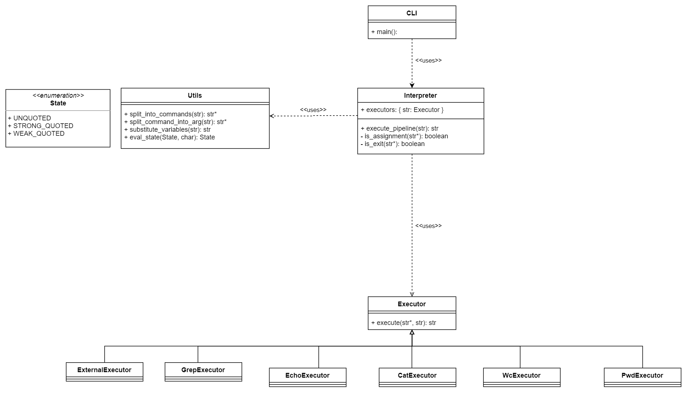

Launch: ```python3 src/cli.py```.
Версия Python должна быть не ниже 3.6.

Для запуска тестов: ```python3 -m unittest```.

Диаграмма:


Что происходит:
При запуске ```main``` создается вызывается функция ```execute_pipeline``` из файла `interpreter`, там команда парсится с помощью функций из модуля `utils` и разбивается на набор команд, проверяется, какая каждая из команд по типу.
В зависимости от типа команд либо запускается нужный экзекьютор из файла `executors`, либо, если это присваивание или выход, выполняется, соответственно, присваивание или выход.
